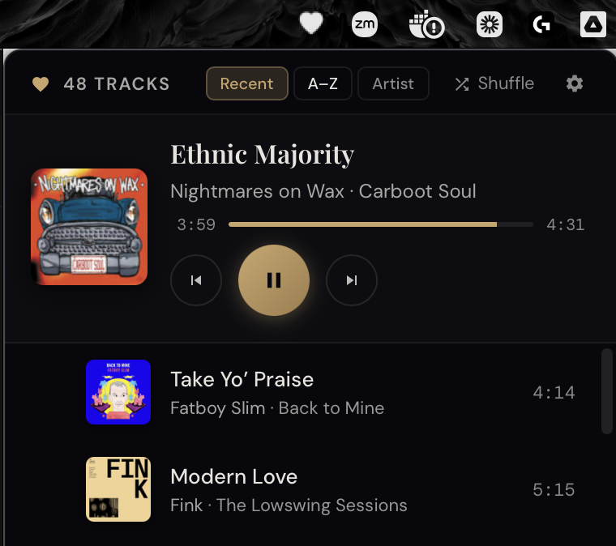

# Heartflow

A macOS menu bar app for shuffling and playing your Plex favourites.



Click the heart icon in your menu bar to open your hearted tracks. Sort by recently added, A–Z, or artist. Hit shuffle or pick a track — it plays directly from your Plex server.

## Features

- Lives in the menu bar — always one click away
- Loads your Plex "❤️ Tracks" smart playlist (falls back to all rated tracks)
- Sort: Recent · A–Z · Artist
- Shuffle play
- Album art, progress bar, prev/next/play controls
- Media key support (play/pause/next/prev)
- Auto-advances through the queue

## Requirements

- macOS 12+
- A running [Plex Media Server](https://www.plex.tv) on your local network
- Your Plex server URL and auth token

## Getting your Plex token

1. Open Plex Web, browse to any item in your library
2. Click ··· → Get Info → View XML
3. Copy the `X-Plex-Token` value from the URL

## Development

```bash
npm install
npm run tauri dev
```

Build a release app:

```bash
npm run tauri build -- --bundles app
```

## Sister app

[Overflow](https://github.com/dajbelshaw/plex-coverflow) — a Cover Flow-style Plex music browser for the desktop.

## Stack

- [Tauri 2](https://tauri.app) — native macOS shell
- React + Vite — UI
- [tauri-plugin-positioner](https://github.com/tauri-apps/plugins-workspace/tree/v2/plugins/positioner) — tray-anchored window placement
